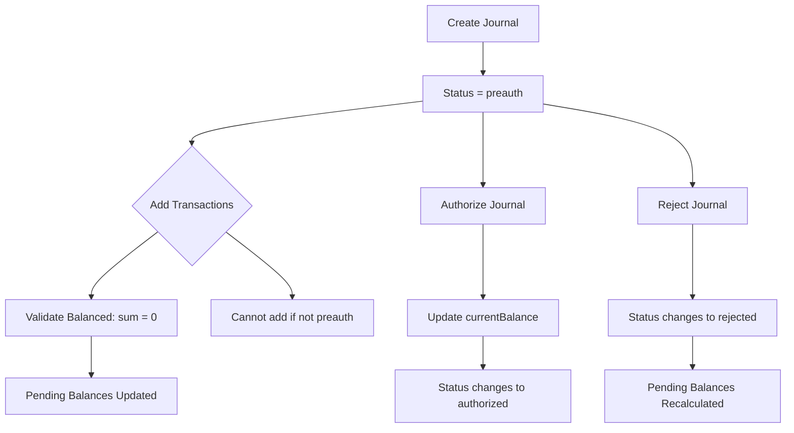

# Journal Flow

This document explains how journals work in the ledger system, how they use accounts, and how balances are updated.

## Core concepts

### Accounts

- Accounts are created with an `accountId`, `name`, `type` (`asset` or `liability`), and an optional `openingBalance`.
- Each account has a linked `Balance` record that tracks the authorized balance.
- Balance responses expose three values:
  - `currentBalance`: The stored authorized balance.
  - `pendingBalance`: The sum of all amounts from transactions in journals that are still in `preauth`.
  - `availableBalance`: `currentBalance - pendingBalance`.

### Journals

- A journal is a container for a balanced set of transactions.
- Each journal has:
  - `journalId`
  - `description`
  - `transactions`
  - `status`
- Valid statuses are:
  - `preauth`
  - `authorized`
  - `rejected`

### Transactions

- Each journal transaction contains an `amount` and an `accountId`.
- In this model, debit and credit are represented by signed amounts:
  - debit amounts are positive
  - credit amounts are negative
- Each journal must balance to zero: the sum of all transaction amounts in a journal must equal `0`.

## Journal lifecycle

### 1. Create a journal (`preauth`)

- Journals are created in the `preauth` state.
- In this state, transactions are stored but not yet applied to account balances.
- Example:
  - create a journal with `journalId = JNL001`
  - description: "Customer payment"
  - transactions:
    - `+500` to `ACC_ASSET_1`
    - `-500` to `ACC_LIABILITY_1`

### 2. Add transactions to a `preauth` journal

- Transactions may only be added while the journal is in `preauth`.
- The system validates that the journal remains balanced after each addition.
- If the journal is not in `preauth`, transaction posting is rejected.

### 3. Review pending balances

- While a journal remains `preauth`, its transactions contribute to the account's pending balance.
- Pending balance is computed by scanning all `preauth` journals that include transactions for the account.
- The account’s available balance is reduced by pending amounts.

### 4. Authorize the journal

- When a journal is authorized:
  - the journal status changes from `preauth` to `authorized`
  - each transaction amount is applied to its account's `Balance`
- Balance update logic aggregates transactions by `accountId` before updating the balance record.
- After authorization:
  - `currentBalance` reflects the committed journal amounts
  - `pendingBalance` drops for the affected accounts
  - `availableBalance` is recalculated accordingly

### 5. Reject the journal

- If the journal is rejected:
  - the status changes to `rejected`
  - transactions remain uncommitted
  - pending balances are recalculated without the journal’s amounts

## Balance behavior

- `currentBalance` is only updated when a journal becomes `authorized`.
- `pendingBalance` tracks amounts that are in `preauth` journals and not yet applied.
- `availableBalance` is the working amount that remains after accounting for pending commitments.

## Example flow

1. Create accounts:
   - `ACC_ASSET_1` asset account with `openingBalance = 100000`
   - `ACC_LIABILITY_1` liability account with `openingBalance = 0`

2. Create journal `JNL_SPEND_001` in `preauth`.

3. Add transactions:
   - `+500` to `ACC_ASSET_1`
   - `-500` to `ACC_LIABILITY_1`

4. Before authorization:
   - `ACC_ASSET_1.currentBalance = 100000`
   - `ACC_ASSET_1.pendingBalance = 500`
   - `ACC_ASSET_1.availableBalance = 99500`

5. Authorize the journal:
   - `ACC_ASSET_1.currentBalance = 99500`
   - `ACC_ASSET_1.pendingBalance = 0`
   - `ACC_ASSET_1.availableBalance = 99500`
   - `ACC_LIABILITY_1.currentBalance = 500`

## Etherfi spend integration

- The `Etherfi` spend flow creates a journal using a configured asset account.
- It debits the asset account and credits the provided liability account in one balanced journal.
- The journal remains `preauth` until explicitly authorized.

## Notes

- Journals must balance exactly to zero before creation or transaction posting will fail.
- Only `preauth` journals can be authorized.
- Rejecting a journal prevents its transactions from affecting authorized balances.
